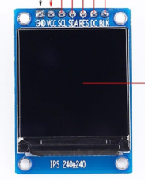
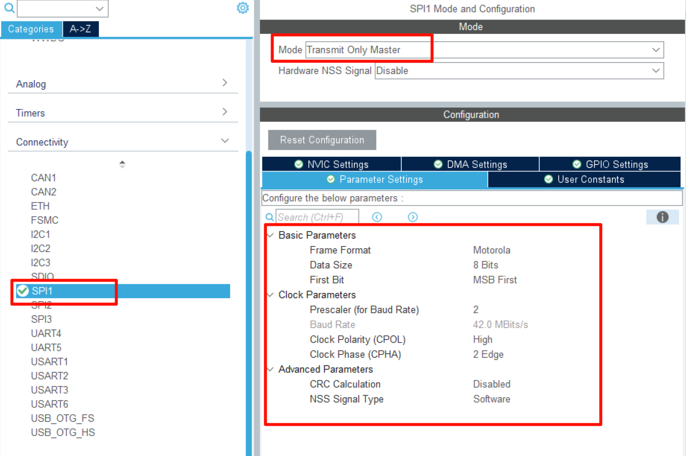
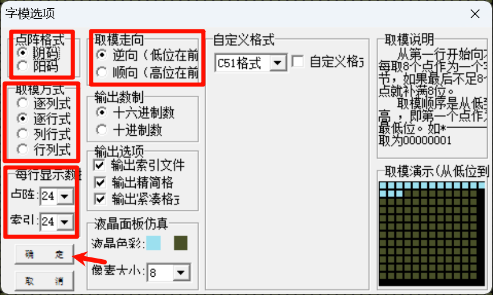

## ST7789v HAL库驱动

驱动ST7789v系列屏幕

## 配置

### 库

hal

### 硬件



### cubemx配置:（可选）



除此之外，还要再开启两个管脚为推挽输出模式用于RST和DC

## 快速使用

### 头文件需要更改

```C
#define ST7789_SPI_PORT hspi1
// Pin
#define ST7789_RST_PORT GPIOE
#define ST7789_RST_PIN  GPIO_PIN_7
#define ST7789_DC_PORT  GPIOE
#define ST7789_DC_PIN   GPIO_PIN_8
```

### 接线

与CuBeMX一致，

### 初始化

```C
ST7789_Init()
```

### 使用

通过调用函数使用

汉字取模如图



## 注意与引用

无
